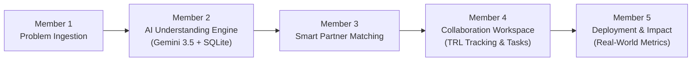

# SOLVESPHERE (SIH 2026)
> **A digital platform to crowdsource societal challenges and facilitate collaborative problem solving through universities and industry partnerships.**

---

## 🌟 Master Unified Architecture

SOLVESPHERE connects citizens, university researchers, and industry leaders through an end-to-end innovation lifecycle:



---

## 🚀 Integrated Modules & API Endpoints

### 🧠 Member 2: AI Understanding Engine
* **`POST /ai/analyze`**: Ingests citizen problem description, invokes Gemini LLM with structured prompt, normalizes tags/domain, and saves result to SQLite (`solutionhub.db`).
* **`GET /ai/analysis/{problem_id}`**: Fast retrieval of structured analysis without re-calling LLM.

### 🤝 Member 4: Collaboration Workspace
* **`GET /collaboration/{project_id}`**: Retrieves project details, TRL level, tasks, files, and discussions.
* **`POST /collaboration/{project_id}/tasks`**: Adds new milestone tasks to the project.
* **`PATCH /collaboration/{project_id}/tasks/{task_id}`**: Updates task status with automated progress percentage recalculation.
* **`POST /collaboration/{project_id}/messages`**: Enables real-time researcher-industry collaboration discussions.

### 📊 Member 5: Deployment & Impact Analytics
* **`GET /deployment/`**: Lists all active field deployments.
* **`GET /deployment/{project_id}`**: Retrieves location, beneficiaries, units deployed, and before/after metrics.
* **`POST /deployment/{project_id}/metrics`**: Adds impact metrics with automated % improvement calculation.
* **`GET /deployment/{project_id}/summary`**: Returns aggregated impact summary and average improvement percentage.

### 🌐 Unified Lifecycle Bridge
* **`GET /pipeline/{problem_id}`**: 360-degree unified view linking AI Understanding $\leftrightarrow$ Collaboration $\leftrightarrow$ Field Deployment.
* **`GET /`**: Platform health check and active module discovery.

---

## 🛠️ How to Run & Test

1. **Install Python Dependencies:**
   ```bash
   pip install -r requirements.txt
   ```

2. **Configure Environment:**
   Ensure `.env` contains your `GEMINI_API_KEY`:
   ```env
   GEMINI_API_KEY=your_gemini_api_key_here
   ```

3. **Start the Unified Server (FastAPI):**
   ```bash
   python app.py
   ```
   * Or run individual workspace router: `py -m uvicorn workspace:app --reload --port 8000`
   * Interactive Swagger UI: `http://127.0.0.1:8000/docs`
   * Redoc Documentation: `http://127.0.0.1:8000/redoc`

4. **Start the Frontend Dashboard (React + Vite):**
   ```bash
   npm.cmd run dev
   ```
   * Open: `http://localhost:5173`

5. **Run Verification Test Suites:**
   ```bash
   python test_m4_m5_m6.py
   python test_llm.py
   ```

